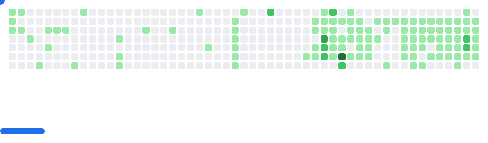

    <h3 align="center">Hello there! 👋
      Welcome to my GitHub profile.
    </h3>

***

### 👨‍💻 About Me:
🐍 My name is Ilya, and I'm passionate about the world of Python, JavaScript and software development. I'm always ready to dive into the world of code and explore new horizons.

💡 My passion for programming ignites every day as I create new projects and tackle complex tasks. Python and JavaScript, for me, is not just a programming language; it's a tool through which I bring my ideas to life and make them a reality.

📚 I'm constantly learning new concepts and technologies to stay up-to-date with the latest trends in the world of development. This is an incredibly exciting journey!

📫 How to reach me: 
***
### 🛠 Languages and Tools:

 
 

***

### 💻 My Projects:
- JavaScript + python = graduation project [diplom_MyCloud](https://github.com/IlyaDyakonov/diplom_MyCloud)
- Python, PostgreSQL, API [dating bot - VKinder 3.0](https://github.com/IlyaDyakonov/VKinder_3.0)
- Python, API [AmountSmart_bot](https://github.com/IlyaDyakonov/AmountSmart_bot)
- Python, API [OOP coursework. "Backup"](https://github.com/IlyaDyakonov/Course_Work)
- JavaScript [Coursework. Mini-game](https://github.com/IlyaDyakonov/JS_Advanced_Diplom)
***
<picture>
  <source media="(prefers-color-scheme: dark)" srcset="images/breakout-dark.svg" />
  <source media="(prefers-color-scheme: light)" srcset="images/breakout-light.svg" />
  
</picture>

### ⚙️ GitHub Analytics:
<table style="border:None; border-collapse:collapse; border-spacing:0;">
    <tr>
        <td align="center">
            
        </td>
        <td align="center">
            
        </td>
    </tr>
        <td align="center">
            
        </td>
        <td align="center">
            
        </td>
</table>

    

        
    

    
    <a href="https://github.com/IlyaDyakonov">
        
    </a>
    

